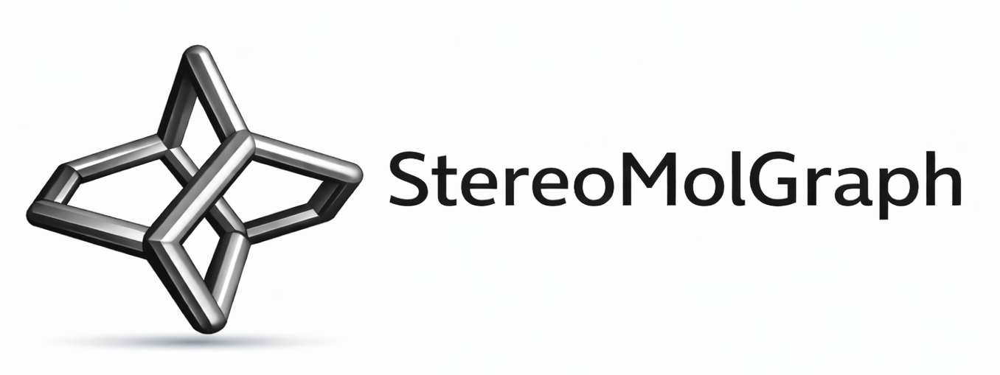

<picture>
  <source media="(prefers-color-scheme: dark)" srcset="docs/_static/img/logo_smg_dark.svg">
  
</picture>

# StereoMolGraph #

[](https://pypi.org/project/StereoMolGraph/)
[](https://www.python.org/)
[](https://opensource.org/licenses/MIT)
[](https://github.com/maxim-papusha/StereoMolGraph/actions/workflows/run_unit_test.yaml)

[](https://stereomolgraph.readthedocs.io)
[](https://chemrxiv.org/doi/full/10.26434/chemrxiv-2025-0g4wn)

StereoMolGraph (SMG) is a lightweight Python library for representing molecules and transition states with explicit, local stereochemistry. It provides:

- Graph types for molecules and reactions (with/without stereo and stereo changes)
- Includes non tetrahedral stereocenters and changing stereochemistry in reactions
- Fast approximate hashing via Weisfeiler–Lehman color refinement
- Robust equality/isomorphism via a VF2++-style algorithm extended for stereochemistry and reactions
- Bidirectional conversion from / to RDKit
- Construction from 3D coordinates with automatic local stereo inference


## Design philosophy

- Unopinionated about bond orders, charge and electronic state
- SMG focuses on the connectivity and stereochemistry. 
- Stereochemistry describes relative spatial arrangement. No absolute stereochemistry.
- Transparent: Simple 2D visualization in IPython notebooks


## Examples

Explore the working example notebooks in `docs/examples/` (executed in CI). For rendered examples and guides, see the documentation: https://stereomolgraph.readthedocs.io

## RDKit interoperability notes

- Hydrogens must be explicit for stereo-safe bidirectional conversion.
- Supports tetrahedral and non tetrahedral stereochemistry during conversion.
- Bond orders, charges, unpaired electrons and other properties are not used!

## Installation

Install from PyPI:

```bash
pip install stereomolgraph
```

## Feedback and support

Bug reports and feature requests are welcome — please open an issue on GitHub:

- Issues: https://github.com/maxim-papusha/StereoMolGraph/issues

If you have questions or ideas that don’t fit a template, you can still open an issue and tag it appropriately.

## Citation

If you use StereoMolGraph in your work, please cite the Zenodo record:

[](https://doi.org/10.5281/zenodo.16360310)

## License

MIT License — see `LICENSE`.

