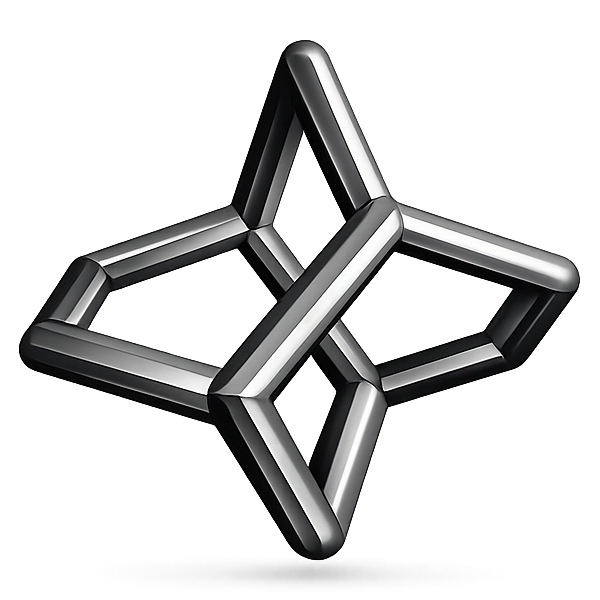
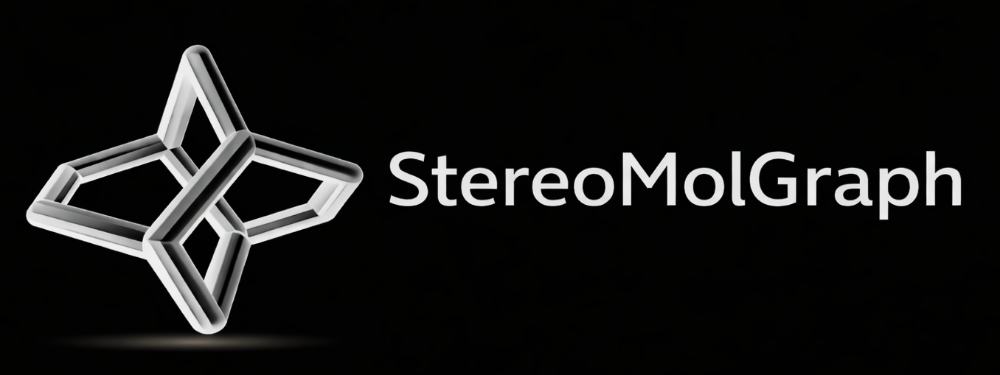

Stereochemistry-Aware Molecular and Reaction Graphs
=====================================================

.. |pypi| image:: https://img.shields.io/pypi/v/StereoMolGraph?style=flat-square&logo=pypi&logoColor=white&color=3775A9
   :target: https://pypi.org/project/StereoMolGraph/

.. |python| image:: https://img.shields.io/pypi/pyversions/StereoMolGraph?style=flat-square&logo=python&logoColor=white&color=3776AB&label=Python
   :target: https://pypi.org/project/StereoMolGraph/

.. |license| image:: https://img.shields.io/badge/License-MIT-d4a017?style=flat-square&logo=opensourceinitiative&logoColor=white
   :target: https://opensource.org/licenses/MIT

.. |tests| image:: https://img.shields.io/github/actions/workflow/status/maxim-papusha/StereoMolGraph/run_unit_test.yaml?branch=main&style=flat-square&label=tests
   :target: https://github.com/maxim-papusha/StereoMolGraph/actions/workflows/run_unit_test.yaml

.. |doi| image:: https://img.shields.io/badge/DOI-10.26434%2Fchemrxiv--2025--0g4wn-ffcc00?style=flat-square
   :target: https://chemrxiv.org/doi/full/10.26434/chemrxiv-2025-0g4wn

.. |docs| image:: https://img.shields.io/badge/Documentation-docs-4C6A92?style=flat-square&logo=readthedocs&logoColor=white
   :target: https://stereomolgraph.readthedocs.io

.. |github| image:: https://img.shields.io/badge/GitHub-repository-2F3E46?style=flat-square&logo=github&logoColor=white
   :target: https://github.com/maxim-papusha/StereoMolGraph

|pypi| |python| |license| |tests| |docs| |github|  |doi|

Welcome to the documentation for **StereoMolGraph**.

This package provides a collection of :doc:`graph classes </reference/graphs/index>` for the representation of molecules and chemical reactions in a modular.
The core focus is to allow the user to work with chiral molecules in a consistent way with a simple interface.
All arising algorithmic difficulties are taken care of by the internal implementations.

Its treatment of stereochemistry is based on rigorously defined local :doc:`stereodescriptors </reference/stereodescriptors>`, which are derived from :doc:`group-theoretical </theory/index>` principles.

Building on this formal foundation, a range of :doc:`graph algorithms </reference/algorithms/index>` is implemented in a stereochemistry-aware manner, enabling consistent handling of symmetry, equivalence, and stereochemical transformations.

Magic Methods:
--------------
- \__eq\__ is based on isomorphism and includes Stereochemistry [1]_
- \__hash\__ is based on morgan like Circular Stereo Algorithm (can have a few hash collisions)

Citing
------

To cite StereoMolGraph please use the following publication:

.. [1] Maxim Papusha, Kai Leonhard. StereoMolGraph: Stereochemistry-Aware Molecular and Reaction Graphs. *ChemRxiv.* **2026**.
   DOI: https://doi.org/10.26434/chemrxiv-2025-0g4wn

.. toctree::
   :maxdepth: 1
   :hidden:

   installation
   tutorial/index
   reference/index

